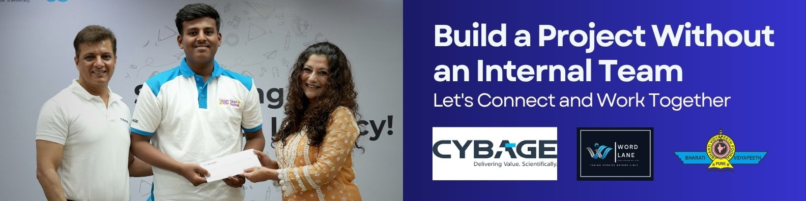

  

<h3 align="center" style="font-family: 'Segoe UI', Tahoma, Geneva, Verdana, sans-serif;">Welcome to my creative space! I'm a passionate developer studying Computer Science & Business Systems at Bharati Vidyapeeth College of Engineering, Pune.</h3>

  
  
  

---

### 👨‍💻 About Me

- 🔭 I’m currently working on building **Decentralized AI Marketplaces** and **High-Performance Web Platforms**.
- 🌱 I’m currently exploring **Advanced Blockchain Architectures** and **AI Integrations**.
- 🏆 Actively participating in **Web3, AI, and Blockchain Hackathons** (DoraHacks, etc.).
- 💬 Ask me about **JavaScript, TypeScript, Java, and Full-Stack Development**.
- ⚡ Fun fact: I love turning complex problems into elegant, decentralized solutions.

---

### 🛠️ Tech Stack & Skills

  

---

### 🚀 Featured Projects

---

### 📊 GitHub Stats

 

---

  

